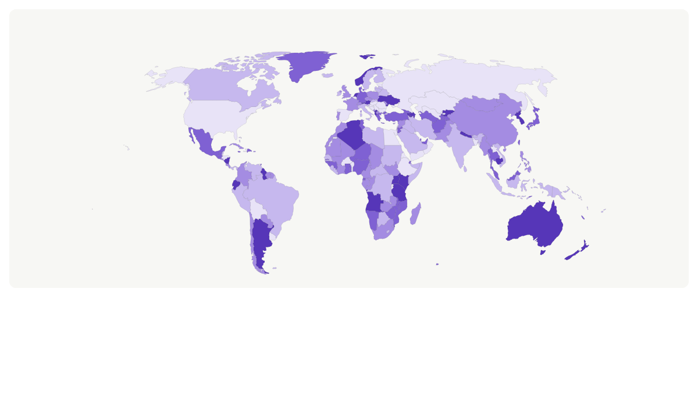
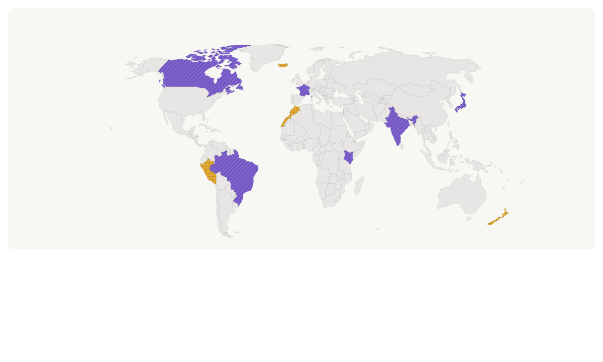
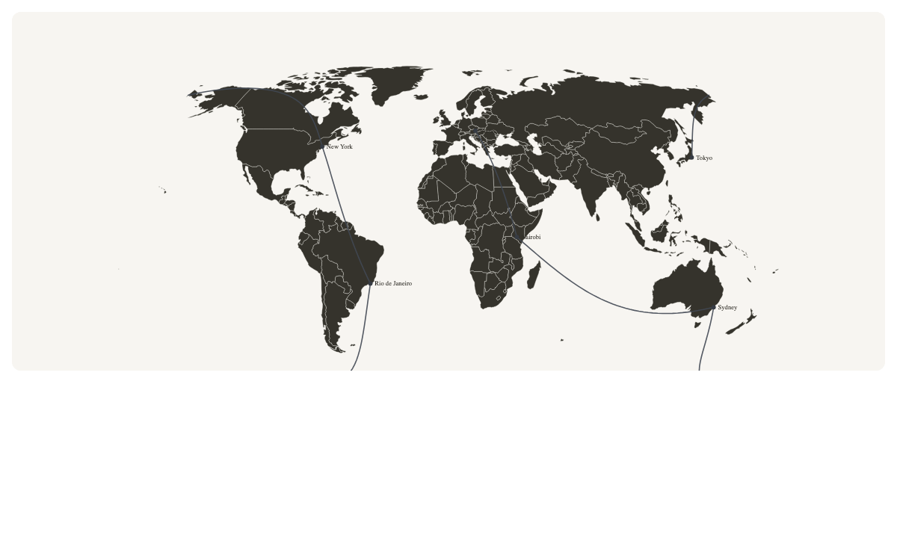
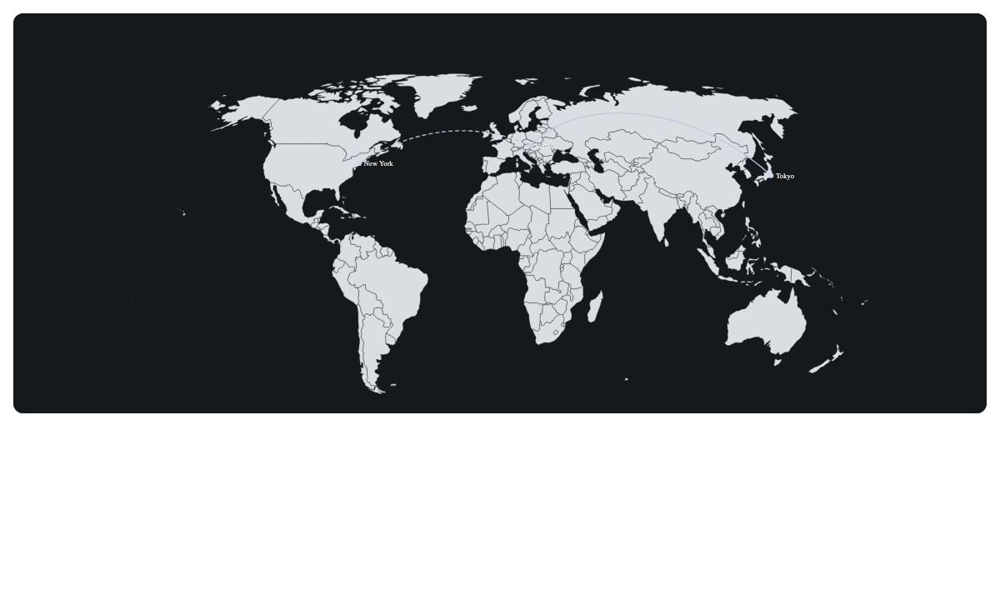

# Documentation

This directory documents `@cublya/geomap` as a library and as a maintained
project. Storybook remains the interactive component catalogue; these guides
cover the concepts, APIs, data flow, integration, and operating procedures that
are easier to understand in long-form documentation.

## Previews

| Choropleth | Patterns | Routes |
| --- | --- | --- |
|  |  |  |
| [Getting started](getting-started.md) | [Theming and accessibility](theming-and-accessibility.md) | [Data and rendering](data-and-rendering.md) |

| Globe | Light preset | Dark preset |
| --- | --- | --- |
|  |  |  |
| [Surface selection](getting-started.md#choose-a-surface) | [Styling model](theming-and-accessibility.md#styling-model) | [Styling model](theming-and-accessibility.md#styling-model) |

## Start here

- [Getting started](getting-started.md): install the package, load a basemap,
  render a first map, and add interaction.
- [API reference](api-reference.md): public components, hooks, stores, data
  types, utilities, and static rendering APIs.
- [Data and rendering guide](data-and-rendering.md): coordinate conventions,
  country preparation, layer composition, projections, and performance.
- [Theming and accessibility](theming-and-accessibility.md): presets, custom
  styles, controls, keyboard support, tooltips, and reduced motion.

## Maintainers and contributors

- [Architecture](architecture.md): package boundaries, runtime data flow,
  design constraints, and where changes belong.
- [Testing and releases](testing-and-releases.md): the test pyramid, fixture
  verification, visual snapshots, CI, and release procedure.
- [Troubleshooting](troubleshooting.md): common integration, rendering, camera,
  styling, and export failures.
- [Contributing](https://github.com/cublya/geomap/blob/main/CONTRIBUTING.md): local
  workflow and coding conventions.

## Project context

- [API design notes](api-design.md): rationale and historical design detail.
- [Basemap coverage](basemap-coverage.md): country coverage by atlas resolution.
- [Examples](https://github.com/cublya/geomap/tree/main/examples): complete,
  typechecked scenarios.
- [Changelog](https://github.com/cublya/geomap/blob/main/CHANGELOG.md): user-visible
  changes by release.

## Documentation ownership

Documentation is part of the public API. A change is not complete until the
relevant guide and example agree with the exported TypeScript types.

| Change | Documentation to update |
| --- | --- |
| Public export, prop, or default | `api-reference.md`, `api-design.md`, README |
| Data preparation or ISO behavior | `data-and-rendering.md`, basemap coverage |
| Theme token or styling hook | `theming-and-accessibility.md` |
| Interaction or camera behavior | API reference and accessibility guide |
| Build, test, or release command | `testing-and-releases.md`, contributing guide |
