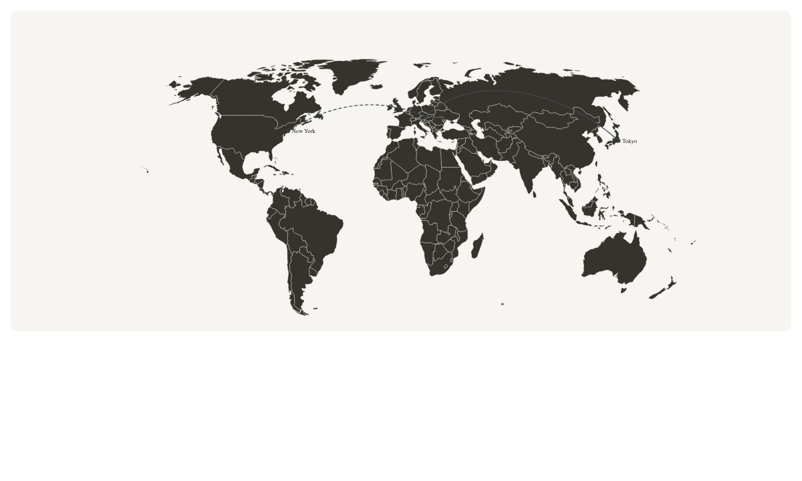
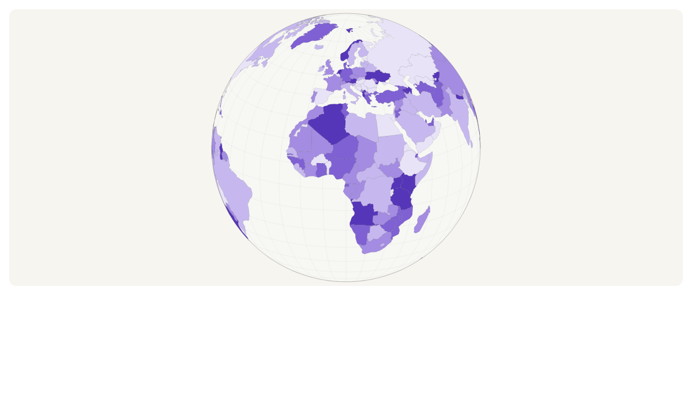

# Getting started

## Requirements

- Node.js 18 or newer for development and build tooling.
- React 18 or newer and `react-dom` in the consuming application.
- A TopoJSON or GeoJSON basemap. Geometry is deliberately not bundled.

Install the renderer and the recommended atlas:

```sh
npm install @cublya/geomap @cublya/world-atlas
```

The package is ESM-only. Import all runtime values and types from
`@cublya/geomap`; import the optional controls stylesheet from
`@cublya/geomap/styles.css`.

## Render a first map



Prepare the basemap once, outside the component render path:

```tsx
import { GeoMap, prepareCountries } from "@cublya/geomap";
import world from "@cublya/world-atlas/countries-10m.json";

const countries = prepareCountries(world, { exclude: ["AQ"] });

export function WorldMap() {
  return (
    <div style={{ width: "100%", height: 480 }}>
      <GeoMap
        preset="light"
        countries={{ data: countries }}
        aria-label="World map"
      />
    </div>
  );
}
```

The rendered surface fills its container. Give the container a definite height;
otherwise a percentage height can resolve to zero. `width` and `height` on
`GeoMap` define the internal coordinate system, not its CSS size.

## Add application data

Keep business data in the application and join it by ISO identity:

```tsx
const scoreByAlpha2 = new Map([
  ["DE", 0.82],
  ["JP", 0.67],
]);

<GeoMap
  preset="light"
  countries={{
    data: countries,
    fill: (country) => {
      const score = country.alpha2 && scoreByAlpha2.get(country.alpha2);
      return score == null ? undefined : score > 0.75 ? "#166534" : "#86efac";
    },
  }}
  aria-label="Scores by country"
/>
```

Returning `undefined` from `fill` uses the theme's muted/no-data color. Do not
mutate `PreparedCountry` objects to attach product state; use their `id`,
`alpha2`, `alpha3`, or `numeric` properties as join keys.

## Add selection and hover

Selection is controlled state. Ocean clicks report `null` so applications can
clear a selection:

```tsx
import * as React from "react";
import { GeoMap, GeoTooltip, type CountryHover } from "@cublya/geomap";

export function SelectableMap() {
  const [selectedId, setSelectedId] = React.useState<string | null>(null);
  const [hover, setHover] = React.useState<CountryHover | null>(null);

  return (
    <>
      <GeoMap
        preset="light"
        countries={{
          data: countries,
          selectedId,
          onSelect: (country) => setSelectedId(country?.id ?? null),
          onHover: setHover,
        }}
        aria-label="Select a country"
      />
      {hover && (
        <GeoTooltip point={hover.point} preset="light">
          {hover.country.name}
        </GeoTooltip>
      )}
    </>
  );
}
```

When `onHover` is present, native SVG country titles are disabled by default to
avoid two tooltips. Set `nativeTitle: true` to retain them deliberately.

## Choose a surface



- Use `GeoMap` for flat projections, cursor-centred zoom, and pan.
- Use `GeoGlobe` for an orthographic globe, backface culling, rotation, inertia,
  and optional idle rotation.
- Use `GeoView` when users should switch between both. It keeps separate cameras
  and transfers geographic centre and range-scaled zoom on each switch.

```tsx
<GeoView
  preset="dark"
  defaultMode="map"
  countries={{ data: countries }}
  toggle
  controls
  aria-label="Interactive world view"
/>
```

`GeoView` is a positioned wrapper and also requires a container with a usable
height. Set `toggle={false}` or `controls={false}` when the host application owns
those controls.

Use `renderer="canvas"` on `GeoMap`, `GeoGlobe`, or `GeoView` when you want a
Canvas-backed map. SVG remains the default and is best when you need DOM
inspection or CSS styling; Canvas keeps the same cameras, gestures, country
callbacks, and built-in layers for denser scenes.

## Use an external camera

An external camera lets other UI drive the view:

```tsx
import { GeoControls, GeoMap, useMapCamera } from "@cublya/geomap";

function MapWithControls() {
  const camera = useMapCamera({ maxZoom: 10 });

  return (
    <div>
      <GeoMap camera={camera} countries={{ data: countries }} preset="light" />
      <GeoControls camera={camera} preset="light" orientation="horizontal" />
      <button onClick={() => camera.fitTo(countries.get("BR")!)}>
        Show Brazil
      </button>
    </div>
  );
}
```

Create cameras with hooks inside React. Use `createMapCamera` or
`createGlobeCamera` for framework-free ownership, long-lived shared state, or
tests.

## Framework notes

### Vite

The normal ESM import works without configuration. JSON imports are supported by
Vite. Keep the atlas import in application code so the chosen resolution is
visible to the bundler.

### Next.js

Render interactive maps from a Client Component because cameras and gestures use
browser APIs:

```tsx
"use client";

import { GeoMap } from "@cublya/geomap";
```

Static SVG generation can run without React or a DOM. PNG conversion is browser
only because it uses `Image`, canvas, and `Blob`.

## Next steps

- Read [Data and rendering](data-and-rendering.md) before integrating a custom
  basemap or writing custom layers.
- Use the [API reference](api-reference.md) for exact public surface details.
- Read [Theming and accessibility](theming-and-accessibility.md) before replacing
  presets or shipping custom controls.
